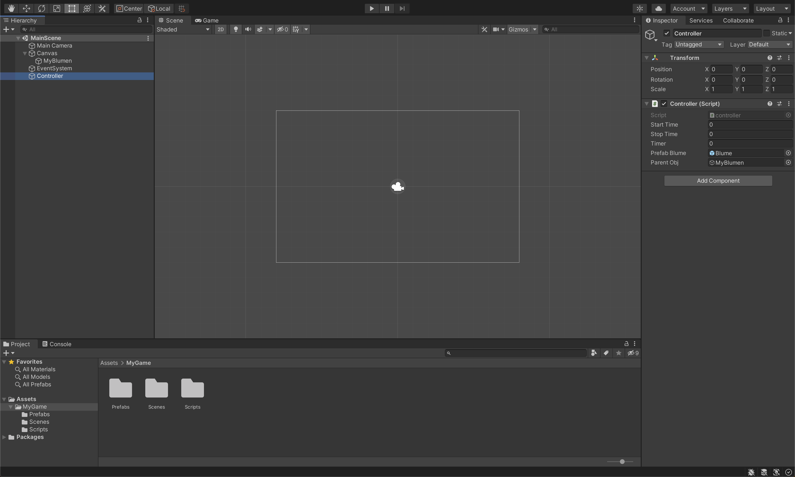
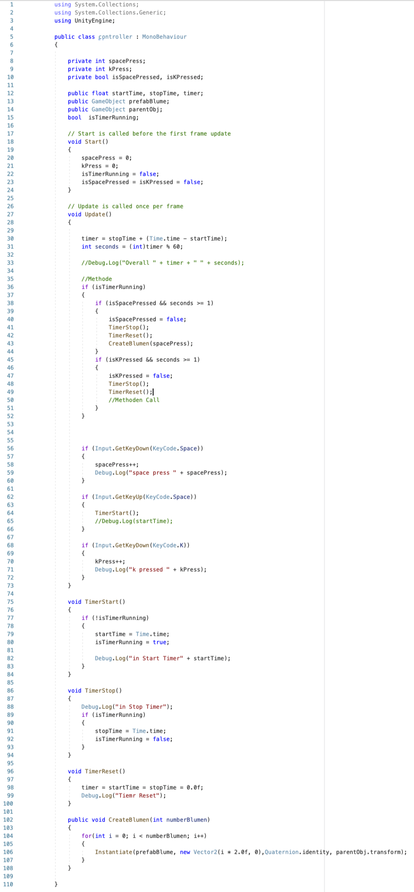

# wh-speedprj-blumen-rKremser

### Project description:
- Blank screen am Anfang
- Input (Key, space/k)
- abhängig vom Input
- Space x-mal gedrückt

### Development platform: 
Mac OS, Unity 2020.1.5f1, Visual Studio 2019, no SDKs

### Target platform: 
WebGL, ref:res 960x600, screen-independent

### Visuals: 

### Necessary setup/execution steps: 
Installation process, e.g. step by step instructions that I can run the project after cloning it

### Third party material: 
-

### Project state: 
100%

### Limitations: 
-

### Lessons Learned: 

Copyright by rKremser
